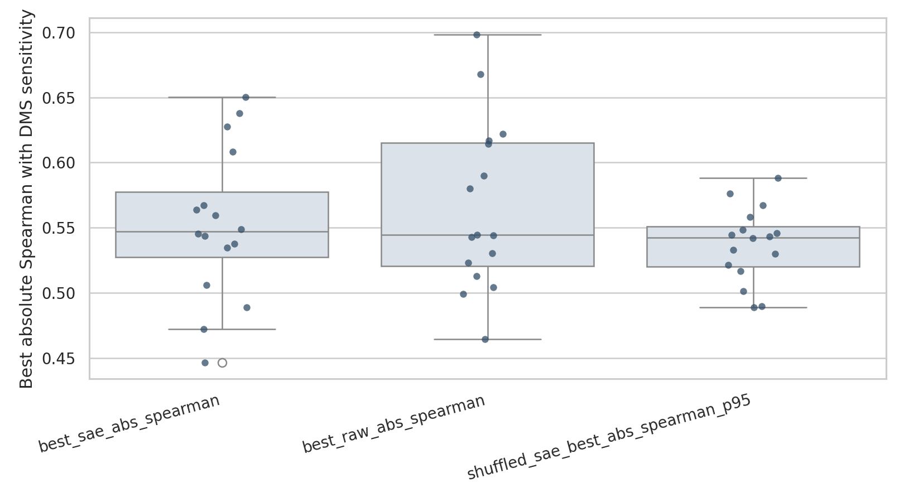
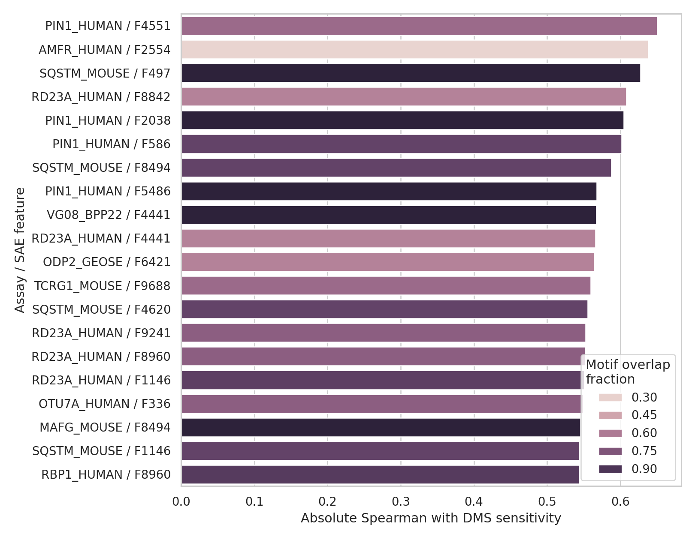
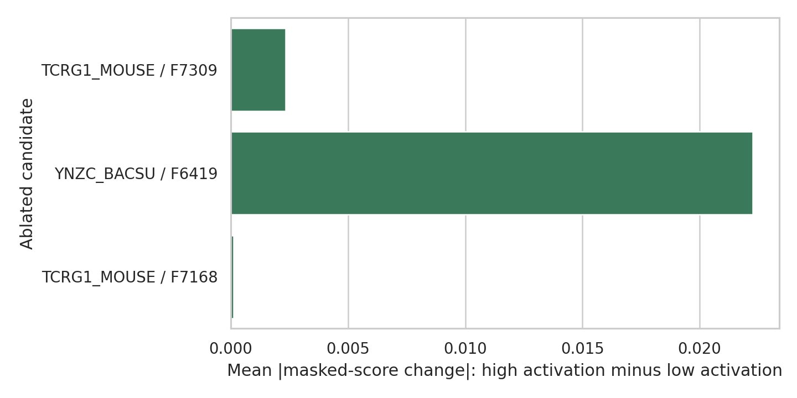

# Discovering Novel Biological Mechanisms from Protein Language Models

## 1. Executive Summary

This study tested whether internal sparse features in a real protein language model identify functionally important protein residues that are not explained by existing motif annotations. I ran ESM-2-8M with pretrained InterPLM layer-4 sparse autoencoder (SAE) features on 16 short ProteinGym DMS assays, screened candidates against ELM/PROSITE motif scans, and ablated selected features inside ESM-2 masked-marginal scoring.

The main result is mixed and conservative: the strongest SAE feature per assay had median absolute Spearman correlation 0.547 with DMS residue sensitivity, but this did not significantly exceed raw ESM hidden dimensions (median 0.544; Wilcoxon one-sided p=0.798) or shuffled SAE controls (median shuffled 95th percentile 0.543; p=0.217). Three low-motif-alignment candidate features were found; one feature ablation, SAE feature 6419 in `YNZC_BACSU_Tsuboyama_2023_2JVD`, produced a larger masked-score change at high-activation positions than low-activation positions (effect 0.0223 log-prob units, Mann-Whitney p=0.00495).

The evidence does not establish a new biological mechanism. It does support a reproducible triage workflow for generating PLM-derived biological hypotheses, while showing that strong novelty claims require stricter controls than feature-function correlation alone.

## 2. Research Question & Motivation

**Question:** Do ESM-2 sparse latent features identify functionally important protein positions that are not aligned with known ELM/PROSITE motif annotations, and do interventions on those features alter ESM-2 mutation-effect predictions?

The motivation follows recent work including InterPLM, InterProt, MotifAE, PLM neuron labeling, and ProteinGym: PLM internals often align with known biology, but the more ambitious scientific question is whether unannotated features can become testable biological hypotheses. This experiment targets that gap by combining feature association, annotation exclusion, and internal intervention.

## 3. Methodology

### Data

- **ProteinGym v1 DMS substitutions:** 16 short assays selected from local `datasets/proteingym_v1/DMS_substitutions`, length 37-52 residues, 12,085 single substitutions, 688 residue positions.
- **Swiss-Prot:** 250 reviewed proteins sampled from `datasets/swissprot/uniprot_sprot.fasta.gz` for candidate motif-alignment checks.
- **ELM and PROSITE:** 482 compiled motif patterns from local `datasets/elm/` and `datasets/prosite/` (353 ELM, 129 PROSITE patterns parsable by the implemented converter).

### Model and Features

- **PLM:** `facebook/esm2_t6_8M_UR50D`, run through Hugging Face Transformers.
- **SAE:** `Elana/InterPLM-esm2-8m`, layer 4, unnormalized SAE weights, 10,240 sparse features over 320-dimensional ESM hidden states.
- **Hardware:** CUDA on NVIDIA RTX A6000 GPUs; the run used `cuda` with masked-position batch size 128. Four A6000 GPUs were available; the script uses one GPU.
- **Runtime:** seeded full run took about 20-21 seconds after model files were cached.

### Protocol

1. Parse single mutants and aggregate DMS scores per residue. Higher `dms_sensitivity` means mutations at that position are more deleterious on average.
2. Compute ESM masked-marginal mutation scores and aggregate them per residue.
3. Extract ESM layer-4 hidden states and InterPLM SAE feature activations for each wild-type target sequence.
4. Compute per-assay Spearman correlations between each SAE feature and DMS residue sensitivity.
5. Compare against raw ESM hidden dimensions and shuffled-position SAE controls.
6. Scan target sequences and Swiss-Prot samples against ELM/PROSITE motifs to identify low-alignment candidates.
7. Ablate selected SAE decoder directions during ESM masked-marginal scoring and compare high-activation versus low-activation residue positions.

### Reproducibility

Random seed was 42. The full experiment was rerun with the same seed; `assay_summary.csv`, `candidate_features.csv`, and `intervention_results.csv` matched byte-for-byte. Aggregate metrics matched exactly except runtime.

## 4. Results

### Aggregate Performance

| Metric | Result |
|---|---:|
| Assays | 16 |
| Total single substitutions | 12,085 |
| Total residue positions | 688 |
| Median best SAE abs Spearman with DMS | 0.547 |
| Median best raw hidden-dim abs Spearman | 0.544 |
| Median shuffled SAE 95th percentile | 0.543 |
| SAE > raw assays | 8 / 16 |
| SAE > shuffled 95th percentile assays | 9 / 16 |
| Wilcoxon SAE > raw p-value | 0.798 |
| Wilcoxon SAE > shuffled 95th p-value | 0.217 |
| Median ESM score vs DMS Spearman | 0.340 |

Bootstrap 95% CIs from `results/statistical_analysis.json`:

- Median best SAE abs Spearman: 0.526 to 0.578.
- Median best raw abs Spearman: 0.523 to 0.615.
- Median SAE minus raw difference: -0.052 to 0.027.
- Median SAE minus shuffled-95th difference: -0.025 to 0.055.

Interpretation: sparse features often correlate with functional sensitivity, but this small-scale assay panel does not show a reliable aggregate advantage over raw coordinates or shuffled sparse features.

### Candidate Features

Three candidate feature-assay pairs passed the low target-motif and low Swiss-Prot motif-alignment heuristic:

| Assay | Feature | Rank in assay | Spearman with DMS sensitivity | Spearman with ESM sensitivity | Target motif overlap | Swiss-Prot motif AUC |
|---|---:|---:|---:|---:|---:|---:|
| `TCRG1_MOUSE_Tsuboyama_2023_1E0L` | 7309 | 4 | -0.484 | -0.262 | 0.000 | 0.508 |
| `YNZC_BACSU_Tsuboyama_2023_2JVD` | 6419 | 5 | -0.400 | 0.028 | 0.000 | 0.486 |
| `TCRG1_MOUSE_Tsuboyama_2023_1E0L` | 7168 | 19 | -0.389 | -0.100 | 0.000 | 0.502 |

These are candidate hypotheses, not discoveries. Their Benjamini-Hochberg q-values over all SAE features were 1.0 because only 200 permutations were used across 10,240 features; the nominal permutation p-values ranged from 0.00498 to 0.0199.

### Interventions

| Assay | Feature | Effect: high minus low activation | Mann-Whitney p |
|---|---:|---:|---:|
| `TCRG1_MOUSE_Tsuboyama_2023_1E0L` | 7309 | 0.00233 | 0.254 |
| `YNZC_BACSU_Tsuboyama_2023_2JVD` | 6419 | 0.02228 | 0.00495 |
| `TCRG1_MOUSE_Tsuboyama_2023_1E0L` | 7168 | 0.00013 | 0.498 |

Feature 6419 is the most interesting follow-up candidate: it had low known-motif alignment and its ablation caused a larger change in ESM masked-marginal scores at high-activation positions. However, it did not correlate strongly with ESM sensitivity, and the intervention was selected after candidate screening, so it should be treated as exploratory.

## 5. Analysis & Discussion

The experiment supports the practical workflow more strongly than the biological novelty claim. Sparse features can highlight DMS-relevant positions, and the low-alignment filters can identify features not captured by the implemented motif scans. But the aggregate comparison shows no statistically reliable SAE advantage in this setup.

The raw hidden-dimension baseline was competitive. This matters because a feature being sparse and interpretable is not sufficient evidence that it captures a distinct biological abstraction. The shuffled-control result also shows that with 10,240 features and short proteins, high correlations can arise by multiple comparisons unless explicitly controlled.

The strongest positive signal is causal rather than correlational: feature 6419 ablation changed ESM variant scores more at high-activation positions. This suggests that at least one low-motif-alignment feature participates in ESM's mutation-score computation. The next step is to test whether the positions share structural, evolutionary, or biochemical coherence beyond the motif databases used here.

## 6. Limitations

- The model was ESM-2-8M, chosen for tractability. Larger ESM-2 models may contain cleaner or different features.
- The DMS panel used 16 short proteins, mostly Tsuboyama assays. This is a useful pilot, not broad biological coverage.
- PROSITE conversion covered only common pattern syntax; unsupported PROSITE profiles/rules were excluded.
- ELM/PROSITE motif scans are imperfect and permissive. The Swiss-Prot motif-positive fraction was high, so "low motif alignment" means low alignment under this implemented scan, not absence of known biology.
- Feature significance was limited by 200 permutations over 10,240 features; candidate q-values did not survive FDR correction.
- Intervention magnitude was measured in masked-marginal log-prob units, not experimental fitness. Follow-up wet-lab or structural validation would be needed.

## 7. Conclusions & Next Steps

This run does not prove that ESM-2 contains previously unknown biological mechanisms. It does produce a working, reproducible pipeline for triaging unannotated PLM features and identifies one exploratory candidate, InterPLM SAE feature 6419 in the YNZC Bacillus assay, where ablation measurably changes model variant scores.

Recommended next experiments:

1. Repeat on ESM-2-650M InterPLM SAEs and more ProteinGym assays.
2. Add structure-aware checks using AlphaFold/PDB residue distances and solvent exposure.
3. Use more exact PROSITE/UniProt annotations instead of regex-only scans.
4. Increase permutation counts or use max-T tests for stricter feature-level inference.
5. Generate targeted variants at candidate high-activation positions and test whether feature-preserving substitutions differ from feature-disrupting substitutions.

## Output Files

- Code: `src/run_experiment.py`
- Main results: `results/aggregate_stats.json`, `results/assay_summary.csv`, `results/candidate_features.csv`
- Interventions: `results/intervention_results.csv`
- Statistical summary: `results/statistical_analysis.json`
- Figures: `figures/baseline_comparison.png`, `figures/top_candidates.png`, `figures/intervention_effects.png`
- Environment: `results/environment.json`, `pyproject.toml`, `uv.lock`

## References

- Simon and Zou, InterPLM: Discovering interpretable features in protein language models via sparse autoencoders.
- Adams et al., From mechanistic interpretability to mechanistic biology.
- Hou et al., MotifAE reveals functional motifs from protein language model.
- Gujral et al., Sparse autoencoders uncover biologically interpretable features in protein language model representations.
- Notin et al., ProteinGym: large-scale benchmarks for protein fitness prediction and design.
- Lin et al., Evolutionary-scale prediction of atomic-level protein structure with a language model.
